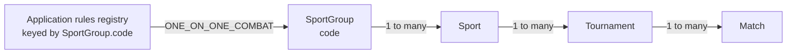

# Martial Arts Scoring

This repository contains the technical foundation, persistence model,
authentication, tournament/match administration, and authenticated realtime
transport for a martial arts scoring system: a React/Vite web application, a
NestJS API, shared TypeScript contracts, PostgreSQL/Prisma, Redis, and Socket.IO.
Admin, referee, and inspector authentication, realtime match transport, and the
authoritative scoring and penalty commands are implemented.

## Tournament athlete API

Registered-athlete CRUD is available under `/api/admin/tournaments/:tournamentId/athletes`, including image replacement/removal. Athlete details are limited to 5,000 characters; birth years are 1900 through the current UTC year. List queries accept `page` (default 1), `pageSize` (default 25, max 100), `search`, `weightClassId`, `organizationId`, `noOrganization`, and `isActive`, returning deterministic name/id order and `{ items, page, pageSize, total, totalPages }`. Deactivated athletes remain editable, but restoration revalidates their weight class and organization. Stable athlete errors are `ATHLETE_NOT_FOUND`, `ROSTER_ASSIGNMENT_NOT_FOUND`, `ATHLETE_UPDATE_EMPTY`, and `INVALID_BIRTH_YEAR`.

## Prerequisites

- Node.js 20.19 or newer
- pnpm 10
- Docker with Docker Compose

## Repository layout

```text
.
├── apps/
│   ├── api/                  # NestJS API
│   └── web/                  # React + Vite frontend
├── packages/
│   └── shared-types/         # Contracts consumed by both applications
├── docker-compose.yml        # Canonical container deployment
├── pnpm-workspace.yaml
└── package.json
```

## Local setup

From this directory, install dependencies and create a local environment file:

```powershell
Copy-Item .env.example .env
pnpm install
```

Start PostgreSQL and Redis for local development and wait for their health checks:

```powershell
pnpm docker:up
docker compose ps
```

Both services bind to the loopback interface only. The development credentials in
`.env.example` are local-only and must not be reused in production.

Apply database migrations, then run the idempotent initial super-admin seed:

```powershell
pnpm --filter @martial-arts-scoring/api prisma:migrate
pnpm --filter @martial-arts-scoring/api prisma:seed
```

The API's Prisma scripts load the monorepo-root `.env`. In a deployed environment,
apply the checked-in migrations non-interactively with
`pnpm --filter @martial-arts-scoring/api prisma:migrate:deploy`.
Run `pnpm --filter @martial-arts-scoring/api prisma:seed` only after a successful
migration deployment. Migrations must be self-contained: the tournament-ownership
migration never relies on the later `superadmin` seed.

The seed ensures the normalized `superadmin` identity exists exactly once, is
active, and has role `SUPER_ADMIN`. It uses bcrypt cost 12 and retains a matching
password hash on repeated runs. `dauvo@123` is a local/staging default only; in
production, `INITIAL_SUPER_ADMIN_PASSWORD` is required and may not use that public
default. The system account intentionally has no email or phone under the Phase 1
legacy/system-account compatibility policy. Password-change-on-first-login is a
follow-up because the schema does not yet track that requirement.

Start the API and web development servers together:

```powershell
pnpm dev
```

You can also start them independently with `pnpm dev:api` or `pnpm dev:web`. The
root development commands build `@martial-arts-scoring/shared-types` first.

By default, the frontend is available at `http://localhost:5173`, and API health is
available at `http://localhost:3000/api/health`.

## Login and super-admin smoke flow

The single application login is `http://localhost:5173/login`; `/admin/login`
only redirects there for old bookmarks. After the local/staging seed, sign in as
`superadmin` with `dauvo@123`. The role-aware landing page is `/super-admin`.
Confirm the session with:

```powershell
Invoke-RestMethod http://localhost:3000/api/auth/me
```

The response contains `user.role` equal to `SUPER_ADMIN` when called by the
signed-in browser (the session cookie is HTTP-only). In `/super-admin`, create a
user, open its detail page, activate admin access with dates and a tournament
limit, suspend/resume it, soft-delete/restore it, then create a pricing version
under `/super-admin/pricing`. Finally log out and confirm `/super-admin` sends
you back to `/login` and `GET /api/auth/me` returns `401` without the cookie.

`dauvo@123` is deliberately a local/staging default, never a production
credential. Production seeding requires a unique, non-default
`INITIAL_SUPER_ADMIN_PASSWORD`; rotate it through the deployment secret manager.

### Legacy ADMIN transitional entitlement migration

Before deploying the migration that introduces this policy, run the read-only
preflight from `apps/api`:

```powershell
pnpm prisma:report:legacy-admin-entitlements
```

The forward-only `20260911150000_legacy_admin_transitional_entitlements`
migration creates one transitional entitlement for each existing active,
non-deleted `ADMIN` user without one. It does not change `SUPER_ADMIN`, `USER`,
inactive, soft-deleted, or already-entitled accounts. Each entitlement begins at
the migration execution time, ends exactly twelve calendar months later, and
has a tournament limit of `max(3, currently owned non-soft-deleted tournaments)`.

At the twelve-month boundary, write access ends. The established entitlement
lifecycle then provides the normal twelve-month owner read-only grace period;
unless an administrator is renewed or adjusted by a super-admin, their owned
tournaments are subsequently soft-deleted by that lifecycle. This is a
one-time compatibility bridge, not an automatically renewing subscription.

To exercise the migration against disposable PostgreSQL databases (a fresh
database and a pre-feature `admin_users` snapshot), run:

```powershell
pnpm prisma:verify:legacy-admin-entitlements
```

## Administration authorization

`USER` accounts cannot access tournament administration. `ADMIN` accounts see
and mutate only tournaments where they are the server-assigned owner; match
administration derives ownership through the tournament. `SUPER_ADMIN` accounts
may access all administration resources. Ownership misses return the same `404`
response used for absent tournaments or matches, preventing existence disclosure.
Referee and inspector match sessions are not part of this authorization policy.

Normal application identities use the unified `User` model and `POST /api/auth/login`,
`POST /api/auth/logout`, and `GET /api/auth/me`. Existing administrator rows are
migrated in place with their IDs, password hashes, timestamps, and audit attribution
preserved. Legacy rows intentionally retain nullable profile fields during this
compatibility phase; registration and profile-completeness rules are deferred.
Referee and inspector match-access sessions remain a separate security domain.

## User registration and read-only viewing

`POST /api/auth/register` creates an active `USER` account and, on success,
establishes the same HTTP-only normal-user session as login. The server ignores
any client-supplied role, activation, ownership, or subscription fields. Usernames
and emails are trimmed and lower-cased for unique normalized database columns;
phone numbers remove formatting characters and convert a leading `00` to `+`.

Authenticated normal users can use `/tournaments`, `/tournaments/:id`,
`/matches/:id`, and `/account`. The read-only API exposes only `ACTIVE` and
`FINISHED` tournaments and deliberately omits owner information, access codes,
participant sessions, monitoring history, and audit records. The list is
deterministically ordered by start date, creation time, and ID, and accepts
`page` and `pageSize` (maximum 50). Protected browser routes retain the requested
return path when redirecting to `/login`.

## Versioned pricing

Pricing is server-owned and does not activate subscriptions or payments. The active
version starts at 200,000 VND for one month and three tournaments. Exact optional
bundles are: 6/12 months at 50,000 VND per month less 10%/25%, and 3/5/10
tournaments at 68,000 VND each less 5%/10%/25%. Amounts are integer VND and
discounts use basis points, so no floating-point money calculation is used.

Authenticated clients request a quote with `POST /api/subscriptions/quote`, for
example `{ "durationBundle": 6, "tournamentBundle": 3 }`. It returns the active
pricing version ID, base/add-on subtotals, discounts, resulting duration and
tournament capacity, and total. Only `SUPER_ADMIN` may list or create versions at
`GET`/`PUT /api/super-admin/pricing`; a new version atomically supersedes the old
one and adds an audit record. Published versions are never edited.

## MVP subscriptions and quotas

`POST /api/subscriptions/activate` is a simulated-success MVP operation, not a
payment-provider confirmation. The request includes an idempotency key; retries
with the same key return the original immutable order and never extend access or
quota twice. The server recalculates the active pricing version and records its
complete quote snapshot. A successful activation grants `ADMIN` role and an
entitlement. Active renewals extend from `activeUntil`; expired renewals start at
activation time. Month arithmetic uses UTC calendar months, including end-of-month
clamping.

The entitlement's tournament limit is the total capacity purchased in its current
active cycle. Each base purchase adds three, and selected tournament bundles add
their purchased capacity. Tournament creation locks the entitlement row, counts
owned tournaments in the same transaction, and rejects exhausted capacity with
`TOURNAMENT_LIMIT_REACHED`; this prevents concurrent last-slot oversubscription.
Subscription orders are intentionally immutable so a future payment provider can
attach provider transaction state without changing entitlement history.

The frontend restores the session with `GET /api/auth/me`, protects role-specific
routes, and invalidates the server-side session on logout. There are no
`SEED_ADMIN_*` variables or legacy `admin/auth/*` endpoints.

The API stores only an opaque, cryptographically random session identifier in an
HTTP-only cookie. Session state and login-rate counters live in Redis; cookie and
authorization headers plus login passwords are redacted from structured logs.
Production cookies are marked `Secure`, and all environments explicitly use
`SameSite=Strict`. Use HTTPS in production and replace every development secret.

## Tournament and match administration

Authenticated admins can create, edit, open, list, and archive tournaments under
`/admin/tournaments`. A tournament can contain matches with exactly one RED and
one BLUE athlete. Match creation atomically persists the match, both athletes,
the referee-staffing snapshot, and its audit event. It never creates per-match
official credentials.

Public match IDs remain cryptographically generated display identifiers. Staff
authenticate with the tournament public code and their own private passcode;
the match is then claimed and staffed through assignment controls.

## Sport catalog and rulesets

The competition domain is `SportGroup 1 -> many Sport 1 -> many Tournament 1 ->
many Match`. A Sport Group is the stable application-level classification that
selects executable rules; a Sport is the catalog choice made for a Tournament.



The catalog migration supplies these active system records:

| Record      | Code                | Vietnamese name |
| ----------- | ------------------- | --------------- |
| Sport Group | `ONE_ON_ONE_COMBAT` | `Đối kháng 1-1` |
| Sport       | `STICK_FIGHTING`    | `Võ Gậy`        |

Only `SUPER_ADMIN` can manage Sports: `GET`/`POST`/`PATCH`
`/api/super-admin/sports` and `GET /api/super-admin/sport-groups`. There is no
Sport deletion endpoint and no Sport Group creation or mutation endpoint. Sport
codes are creation-time identifiers and are not editable. The catalog API writes
an `ADMIN_ACTION` audit record for every Sport creation or update.

An active `ADMIN` (for owned records) or `SUPER_ADMIN` may obtain selectable
Sports only through `GET /api/admin/sports`; it returns active Sports only. The
Tournament create/edit UI uses that list. A Tournament may change to another
active Sport only before its first Match is created. Once any Match exists, a
change is rejected with `TOURNAMENT_SPORT_CHANGE_NOT_ALLOWED`.

A Sport with one or more stored Tournaments is _used_, including a Tournament
that is archived or soft-deleted. A used Sport cannot be disabled or moved to a
different Sport Group (`SPORT_IN_USE` or `SPORT_GROUP_CHANGE_NOT_ALLOWED`). The
database foreign keys from Tournament to Sport and Sport to Sport Group use
`RESTRICT`; do not manually edit production rows to bypass these guards. The
implemented lifecycle permanently deletes a Tournament after its purge deadline,
so that deleted Tournament no longer contributes a usage reference. This does
not provide a manual Sport-delete workflow.

### Adding Sports and Groups

To add a Sport under an existing, supported group, use the Super Admin UI at
`/super-admin/sports` or `POST /api/super-admin/sports`, select the existing
group, and create it active. Confirm it appears in `GET /api/admin/sports`.
No scoring implementation is required: every Sport in that group resolves to
the same ruleset.

Adding a new Sport Group is an engineering release, not a UI operation:

1. Implement and test its ruleset strategy, then register its immutable code in
   [`SportRulesRegistry`](apps/api/src/sport-rules/sport-rules.registry.ts).
2. Add the group through a reviewed migration/system-data change, not a UI
   mutation. Deploy the executable strategy before adding Sports to that group.
3. Add its Sports only after the ruleset is deployable.
4. Verify match creation, roles, lifecycle, scoring, penalties, realtime
   payloads, scoreboard, audit records, and migration behavior.
5. Never use, or introduce, a silent fallback to `ONE_ON_ONE_COMBAT`.

See [ADR 0013](docs/adr/0013-sport-group-ruleset-resolution.md) for the
ruleset-resolution decision and [release readiness](docs/release-readiness.md)
for migration and operator checks.

## Tournament official authentication and operations

Display the tournament public code to staff, create referee and inspector records
from the tournament administration page, and distribute each one-time private
passcode over a secure out-of-band channel. Referees sign in at `/trong-tai` and
inspectors at `/giam-dinh` using that code and passcode. An inspector claims a
match, assigns the configured referee positions, and starts it only after dynamic
readiness is satisfied. Bracket-round staffing determines the immutable referee
count for subsequently prepared matches.

Regenerate a passcode only from official administration and distribute the new
one-time value immediately. For a stuck assignment, the claimed inspector can
release or replace it; deactivating an official also releases their active work.
Passcodes are never returned after their create/regenerate response.

## Legacy match credential transition

`MatchAccessCode`, `MatchSession`, `MatchAccessRole`, and `RefereeSlot` remain
only for historical rows, legacy-session scoring, and migration fixtures. The
legacy `/api/match-access/*` API is disabled unless
`LEGACY_MATCH_ACCESS_ENABLED=true`; it is never used by modern UI flows and
rejects a match with an active assignment. Its cookie is separate from the
tournament-official cookie. Remove this API, its tables, and its legacy slot
contracts in a separately reviewed destructive migration after the transition
window closes and all active legacy sessions have expired.

The participant-auth API consists of:

The normal operational APIs are `/api/official-access/*` and the assignment
endpoints. PostgreSQL, not Redis, remains the authority for claims, assignments,
votes, and lifecycle.

## Realtime match infrastructure

Authenticated referee and inspector pages connect to Socket.IO through
`/api/socket.io`. The handshake path deliberately remains below `/api`, matching
the path of the HTTP-only participant-session cookie. The development proxy
forwards both HTTP and WebSocket traffic, while direct cross-origin deployments
must use the configured `WEB_ORIGIN` with credentials enabled.

The gateway is match-participant scoped in this phase because there are no admin
realtime commands yet. It validates the `MatchSession` cookie during the Socket.IO
handshake, resolves session ID, internal and public match IDs, role, referee slot,
and device ID on the server, then joins only `match:{publicMatchId}` derived from
that identity. There is no client-controlled room-join event. Every exposed match
command revalidates current database ownership, so changing an event payload
cannot select a different match and a revoked owner immediately loses command
permission.

`presence:updated` reports two deliberately separate facts for `REFEREE_1`,
`REFEREE_2`, `REFEREE_3`, and `INSPECTOR`: whether PostgreSQL has an active
authenticated owner and how many sockets are currently connected. A temporary
disconnect removes only socket presence; it does not revoke the login session.
Takeover, logout, and access-code regeneration revoke the database session after
their transaction commits, emit `session:revoked` to any old in-process sockets,
and disconnect them.

On every initial connection or reconnect, the browser performs a fresh cookie
handshake and requests `match:state`. The snapshot contains match identity,
athletes, status, current round, scores aggregated from persisted score events,
and presence. Subsequent events update that snapshot. Connected-socket tracking
is intentionally in memory for the current single-API deployment; PostgreSQL
remains the session-ownership authority. A multi-instance deployment should add
the Socket.IO Redis adapter and distributed presence tracking.

## Match lifecycle and timing

The persisted match lifecycle is deliberately narrow:

```text
WAITING -> ROUND_1_RUNNING -> BREAK -> ROUND_2_RUNNING -> FINISHED
```

Only the authenticated inspector for that match may send `round:start`. It starts
Round 1 from `WAITING` or Round 2 from `BREAK`; every other state and every other
participant role is rejected. Admin match editing cannot mutate lifecycle status
directly. The break remains in `BREAK` until the inspector explicitly starts
Round 2.

For each start, the API takes the server time, reads the match's persisted
`roundDurationMs`, calculates `endsAt`, and atomically persists the `Round`, match
transition, and `ROUND_STARTED` audit record. The resulting `round:started` and
fresh `match:state` payloads carry the authoritative timestamps. Browser timers
derive their display from `endsAt`; reaching zero in the browser never changes
official state.

An in-memory timer handles the normal expiration path, but it is only a wake-up
mechanism. Before ending a round, the API rechecks the persisted row and timestamp
under a database lock. Startup recovery scans unended active rounds, immediately
reconciles overdue timestamps, and reschedules future ones. Round 1 expiration
persists `BREAK` and emits `round:ended`; Round 2 expiration persists `FINISHED`,
adds `ROUND_ENDED` and `MATCH_FINISHED` audit records, and emits both
`round:ended` and `match:finished`. A fresh `match:state` follows each transition.

## Server-side scoring windows

Only an authenticated referee can send `vote:submit` with `{ "athlete": "RED" }`
or `{ "athlete": "BLUE" }`. The server resolves the referee slot from the active
match session; browser time and browser-supplied identity are never used for an
official vote. The first valid vote opens a persisted 1,000 ms half-open window:
`startedAt <= serverReceivedAt < endsAt`. Each referee slot can persist one vote
per window, and a window awards exactly one point only when at least two votes
select the same athlete.

Official scoring state is serialized by `SELECT ... FOR UPDATE` on the match row,
using PostgreSQL's `clock_timestamp()` after the lock is acquired. This works
across API instances. Database partial unique indexes are the final safeguards for
one unresolved window per match and one `REFEREE_POINT` score event per window.
Redis is intentionally not the official score lock: evicting or losing a Redis
key must never allow a duplicate score. Timers merely prompt normal resolution;
startup recovery rechecks every unresolved persisted window and resolves overdue
ones transactionally.

Accepted votes remain in `referee_votes` with their server timestamp, referee
slot, athlete color, and session. Resolution persists the winning color and
score-awarded flag on `scoring_windows`, creates the score event when applicable,
and emits `vote:accepted`, `vote:rejected`, `scoring-window:opened`,
`scoring-window:resolved`, and `score:updated` events.

## Referee console

`/trong-tai` is a touch-first referee screen. It restores the HTTP-only match
session after a refresh, reconnects the Socket.IO session, and renders the
authoritative match ID, referee slot, athletes, round, connection state, and
server-derived display timer. It deliberately does not display or calculate a
majority decision, official score, vote timestamp, or scoring-window duration.

A RED or BLUE press is synchronously protected against accidental double taps.
The UI remains locally locked while it waits for `vote:accepted`; only that event
displays a recorded choice. It remains locked for the referee's current scoring
window and unlocks on `scoring-window:resolved`. Direct authenticated snapshots
include that referee's own accepted vote, when one exists, so a refresh or
reconnect preserves this display lock. That recipient-specific `viewer` state is
never included in room-wide `match:state` broadcasts.

## Inspector violations and penalties

Only an authenticated inspector can send `penalty:add` with
`{ "athlete": "RED" }` or `{ "athlete": "BLUE" }`. The server derives the
match, session, and active round from the participant cookie; it accepts a
penalty only while Round 1 or Round 2 is running and before the persisted round
end time. Breaks and finished matches are rejected.

The match row and inspector session are locked with PostgreSQL inside one
transaction. That transaction creates a `Penalty` (`-1`), its linked `PENALTY`
`ScoreEvent`, and a `PENALTY_ACTION` audit record. The official score is always
the sum of the immutable score-event ledger, while the violation count is the
persisted count of penalties per athlete. On commit the authorized match room
receives `penalty:added`, `score:updated`, and a fresh `match:state` snapshot.

Each `penalty:add` represents a deliberate physical press. The required protocol
does not include a client request ID, so two delivered commands are retained as
two penalties rather than using timing heuristics that could discard a valid
second violation. A future retriable command protocol must add a stable request
ID before claiming idempotency.

## Inspector console

`/giam-dinh` is the production, touch-first inspector screen. It reuses the same
HTTP-only participant-session recovery and takeover flow as the referee screen,
then rebuilds its display from authoritative Socket.IO snapshots after a refresh
or reconnect. It shows the match ID, athletes, official score, persisted
violation counts, round state, server-derived display timer, and Vietnamese
connection status.

The inspector screen only emits `round:start` and `penalty:add`; it never changes
round state or score locally. It exposes the start control only in `WAITING` and
`BREAK`, and enables RED/BLUE penalties only during an active round. A penalty
requires a second press on the same colour within 1.8 seconds, which avoids an
extra blocking confirmation while reducing accidental touches. Disconnects or a
session takeover immediately disable live controls until the authoritative session
is restored.

## Public scoreboard and admin monitoring

Open `/bang-diem?match=A72K9P` (or `/bang-diem/A72K9P`) for the television/projector
scoreboard. It uses an isolated read-only Socket.IO room and receives only a
filtered `scoreboard:state` snapshot: public match identity, status, active-round
timestamps, athlete names/organisations, official score, and violation totals.
It never receives access codes, session tokens, internal IDs, presence, or referee
votes. On a reconnect it retains its last display and requests a new authoritative
snapshot.

`/admin/matches/:matchId` now provides protected live monitoring, refreshing the
authoritative state and presence every 1.5 seconds. It also exposes resolved
scoring windows (including each referee vote), penalty history, immutable score
events, and audit logs so an administrator can trace the score to its source.

## Operational hardening

PostgreSQL is the authoritative store for match lifecycle, active rounds,
scoring windows, referee votes, score events, penalties, and match sessions.
At startup the API replays persisted active-round expiration and unresolved
scoring-window resolution; both paths lock the match row and use conditional
database updates, making replays safe across restarts and multiple API
instances. Redis is used only for ephemeral rate limits, admin sessions and
Socket.IO fan-out. Resetting Redis can require an admin to sign in again and
rebuilds presence as browsers reconnect, but cannot alter official results.

Socket.IO uses the official Redis adapter, so private match-room and public
scoreboard-room publications propagate across API instances. Every sensitive
command still validates its persisted session inside the PostgreSQL transaction;
the adapter is transport, never scoring authority. `vote:submit` is naturally
idempotent per referee/window through the database unique constraint and locked
match row. Round starts and takeovers are likewise serialized by persisted
state. Penalties represent deliberate separate presses; they are not blindly
retried by the client because the current protocol has no stable request ID.

Connected presence is an expiring Redis counter per public match and access
role, so the count is shared by all API instances. It is intentionally
ephemeral: after a Redis reset it starts at zero and is rebuilt as sockets
reconnect; the persisted `MatchSession` query continues to distinguish an
active credential from a currently connected browser.

Health probes are available at `/api/health/live` (process liveness only) and
`/api/health/ready` (PostgreSQL and Redis readiness). `/api/health` remains a
compatibility alias for the readiness report.

## Database domain model

The Prisma schema and migration history live in `apps/api/prisma`. The initial
migration creates admin users, tournaments, matches, athletes, access codes,
sessions, rounds, scoring windows, referee votes, score events, penalties, and
audit logs.

PostgreSQL enforces unique public match IDs, one athlete per color in a match, one
access code per credential role in a match, one persisted round number per match,
and one vote per referee slot in a scoring window. The database therefore prevents
duplicates. The admin match-creation service adds the application-level invariant:
it commits exactly one RED athlete, one BLUE athlete, all four access credentials,
and the creation audit event in a single transaction.

## Environment variables

| Variable                                           | Example/default                   | Purpose                                            |
| -------------------------------------------------- | --------------------------------- | -------------------------------------------------- |
| `DATABASE_URL`                                     | PostgreSQL URL in `.env.example`  | Prisma database connection                         |
| `REDIS_URL`                                        | `redis://localhost:6379`          | Redis connection and admin-session storage         |
| `API_PORT`                                         | `3000`                            | API listen port                                    |
| `IMAGE_STORAGE_DRIVER`                             | `local`                           | Exact image-storage provider: `local` or `s3`      |
| `IMAGE_UPLOAD_ROOT`                                | `public/uploads`                  | Local-mode root, relative to API working directory |
| `S3_BUCKET`                                        | Required for `s3`                 | S3 image bucket; no credentials belong in config   |
| `AWS_REGION`                                       | Required for `s3`                 | AWS region for the S3 image bucket                 |
| `WEB_ORIGIN`                                       | `http://localhost:5173`           | Allowed credentialed browser origin                |
| `VITE_SOCKET_PATH`                                 | `/api/socket.io`                  | Browser and server Socket.IO handshake path        |
| `ADMIN_SESSION_SECRET`                             | Development placeholder           | HMAC secret for admin-session identifiers          |
| `ADMIN_SESSION_TTL_SECONDS`                        | `28800`                           | Fixed Redis lifetime for admin sessions            |
| `ADMIN_LOGIN_RATE_LIMIT_MAX_ATTEMPTS`              | `5`                               | Login attempts allowed per window                  |
| `ADMIN_LOGIN_RATE_LIMIT_WINDOW_SECONDS`            | `900`                             | Login throttle window in seconds                   |
| `MATCH_SESSION_SECRET`                             | Development placeholder           | Legacy match-session tokens/challenges only        |
| `MATCH_SESSION_TTL_SECONDS`                        | `28800`                           | Persisted match-session lifetime                   |
| `MATCH_ACCESS_RATE_LIMIT_IDENTITY_MAX_ATTEMPTS`    | `10`                              | Attempts per match credential/window               |
| `MATCH_ACCESS_RATE_LIMIT_IP_MAX_ATTEMPTS`          | `100`                             | Attempts per client address/window                 |
| `MATCH_ACCESS_RATE_LIMIT_WINDOW_SECONDS`           | `60`                              | Participant-auth throttle window                   |
| `LEGACY_MATCH_ACCESS_ENABLED`                      | `false`                           | Temporary historical match-access compatibility    |
| `OFFICIAL_PASSCODE_SECRET`                         | Development placeholder           | HMAC key for official passcode lookup digests      |
| `OFFICIAL_SESSION_SECRET`                          | Development placeholder           | Independent HMAC key for official sessions/CAS     |
| `OFFICIAL_SESSION_TTL_SECONDS`                     | `28800`                           | Persisted tournament-official session lifetime     |
| `OFFICIAL_ACCESS_RATE_LIMIT_IDENTITY_MAX_ATTEMPTS` | `10`                              | Attempts per official credential/window            |
| `OFFICIAL_ACCESS_RATE_LIMIT_IP_MAX_ATTEMPTS`       | `100`                             | Attempts per client address/window                 |
| `OFFICIAL_ACCESS_RATE_LIMIT_WINDOW_SECONDS`        | `60`                              | Official-auth throttle window                      |
| `MATCH_PUBLIC_ID_INITIAL_LENGTH`                   | `6`                               | Initial human-friendly public match ID length      |
| `INITIAL_SUPER_ADMIN_PASSWORD`                     | `dauvo@123` (non-production only) | Required non-default secret for production seed    |
| `ROUND_DURATION_MS`                                | `120000`                          | Round duration in milliseconds                     |
| `BREAK_DURATION_MS`                                | `60000`                           | Break duration in milliseconds                     |

Use independent, randomly generated session and passcode-digest secrets outside local development. `OFFICIAL_PASSCODE_SECRET` and `OFFICIAL_SESSION_SECRET` must be different from each other and from the legacy match/admin session keys; rotating either invalidates the corresponding lookup or sessions.
Match timing has one configuration source: change `BREAK_DURATION_MS` rather than
embedding a break duration in application code.

## Quality checks

Run the same checks expected before merging:

```powershell
pnpm lint
pnpm typecheck
pnpm build
pnpm test
pnpm format:check
```

Stop local infrastructure with `pnpm docker:down`. Named volumes preserve data;
removing them is an explicit manual operation.

## Production deployment

`docker-compose.yml` is the sole supported container topology. It runs PostgreSQL,
Redis, NestJS, the compiled Vite static site, and an edge Nginx proxy. Copy
`.env.example` to a separate
`.env.production`, set non-default database credentials and independent 32+
character session secrets, set `WEB_ORIGIN` to the public HTTPS origin, and set
`INITIAL_SUPER_ADMIN_PASSWORD` to a unique production secret. Never use
`dauvo@123` outside local/staging, and never put the production password on a
command line or in a committed file.

### Initial production bootstrap (once per database)

The `bootstrap` Compose service is a one-shot, profile-gated job. It waits for
the PostgreSQL health check, runs `prisma migrate deploy`, runs the idempotent
seed, and verifies that normalized `superadmin` is active, not deleted, and has
role `SUPER_ADMIN`. It does not print the password or password hash. The normal
`api` service runs migrations on startup but never runs this seed, so routine API
restarts cannot reset the Super Admin password.

Run these commands in order after storing the production secrets in
`.env.production`:

```powershell
# 1. Start only dependencies and wait for PostgreSQL/Redis health checks.
docker compose --env-file .env.production up --build -d postgres redis
docker compose --env-file .env.production ps

# 2. Run the explicit, one-shot database bootstrap. A non-zero exit stops at
# the failing migration, seed, or verification step.
docker compose --env-file .env.production --profile bootstrap run --rm bootstrap

# 3. Start the application only after bootstrap succeeds.
docker compose --env-file .env.production up --build -d api web nginx
docker compose --env-file .env.production ps
```

The bootstrap deliberately fails before making seed changes when
`INITIAL_SUPER_ADMIN_PASSWORD` is missing or equals the public default in a
production environment. It also fails clearly when migration deployment, seeding,
or account verification fails. It is safe to run again against an already-seeded
database with the same bootstrap secret: migrations remain applied, the seed
retains the matching hash, and verification passes. Treat changing this bootstrap
secret as a deliberate credential-rotation action, not a routine deployment step.

### Production verification

Use the following post-bootstrap checks; none display a password or hash:

```powershell
# Service status and applied-migration status.
docker compose --env-file .env.production ps
docker compose --env-file .env.production --profile bootstrap run --rm --no-deps bootstrap pnpm --filter @martial-arts-scoring/api prisma:migrate:status

# Confirm seed completion/account state without exposing credentials.
docker compose --env-file .env.production --profile bootstrap run --rm --no-deps bootstrap pnpm --filter @martial-arts-scoring/api prisma:verify:super-admin
```

For an authenticated API check, enter the password at the prompt (it is not
echoed or included in shell history), then reuse the returned HTTP-only session:

```powershell
$baseUrl = 'https://score.example.com' # Replace with the deployed public origin.
$securePassword = Read-Host 'Super Admin password' -AsSecureString
$password = [System.Net.NetworkCredential]::new('', $securePassword).Password
$body = @{ username = 'superadmin'; password = $password } | ConvertTo-Json
$login = Invoke-WebRequest -Method Post -Uri "$baseUrl/api/auth/login" -ContentType 'application/json' -Body $body -SessionVariable session
$password = $null
Invoke-RestMethod -Uri "$baseUrl/api/auth/me" -WebSession $session
```

The final response must show `user.role` as `SUPER_ADMIN`. In a browser using the
same production origin, sign in as `superadmin`; the role-aware landing page must
be `/super-admin`, where the Super Admin navigation is visible. This verifies both
the browser session and role-aware navigation. Before production rollout, rehearse
steps 1–3 against a fresh staging database, then rerun step 2 unchanged against
that already-seeded database; both bootstrap runs must succeed.

Nginx proxies all `/api/*` requests, including `/api/media/{resource}/{filename}`
to NestJS; it has no media-file alias. The API therefore remains the sole
authoritative image reader in both local and S3 modes and preserves its
`Content-Type`, `Content-Length`, immutable cache, and `X-Content-Type-Options`
headers. `/api/socket.io/` remains the more-specific WebSocket location with
HTTP upgrade headers. The web container serves the immutable React build. Put an
HTTPS-capable reverse proxy or load balancer in front of Nginx and forward
`X-Forwarded-Proto: https`;
the browser will then use HTTPS/WSS on the single public origin. Do not expose
PostgreSQL or Redis ports in production. Back up the database and review the
checked-in Prisma migrations before the one-shot bootstrap. The API's restart-safe
migration deployment remains separate from Super Admin seeding.

See [the release-readiness runbook](docs/release-readiness.md) for the permission
matrix, complete endpoint and Socket.IO contract, retention operation, migration
restore policy, and production checklist.

Architecture decisions: React + Vite keeps the operator UI a small static
client rather than requiring a Next.js server; NestJS owns every authorization
and match decision; PostgreSQL is durable truth; Redis provides rate limiting,
shared presence and Socket.IO distribution; Socket.IO distributes snapshots and
events; `serverReceivedAt` defines official vote time; immutable score events
provide history; and one persisted active session owns each credential.

### Image storage

`IMAGE_STORAGE_DRIVER` is exact and case-sensitive: unset or `local` selects the
local provider; only `s3` is the other accepted value. Values are not trimmed, so
an empty, whitespace-only, or unsupported value fails startup. In local mode,
images are stored as UUID object keys below `IMAGE_UPLOAD_ROOT` (default
`apps/api/public/uploads` when the API is run from its package directory).
Docker Compose mounts this directory as the named `api_uploads` volume.

### Local VPS configuration

For a VM/VPS, use the Compose defaults (or set them explicitly):

```dotenv
IMAGE_STORAGE_DRIVER=local
IMAGE_UPLOAD_ROOT=/workspace/apps/api/public/uploads
```

`api_uploads` is a persistent Docker named volume mounted only by the API. It is
not mounted in Nginx because media is always streamed by `MediaController` at
`/api/media/{resource}/{filename}`. Docker volumes survive container recreation
but not an intentional `docker volume rm` or loss of the host. Include it in the
host backup plan, for example by archiving a stopped or read-only-mounted volume
alongside a tested PostgreSQL dump; restore both database and matching image
objects together. A bind mount on separately backed-up host storage can replace
the API's `api_uploads:/workspace/apps/api/public/uploads` mount if that matches
your operations policy. Free-platform ephemeral disks can lose uploads and
multiple API replicas need shared object storage.

### AWS S3 configuration

S3 objects stay private. NestJS reads them with the AWS SDK and streams bytes on
the same browser URL; it never redirects the browser to an S3 or presigned URL.
Set these values in the uncommitted production environment file:

```dotenv
IMAGE_STORAGE_DRIVER=s3
S3_BUCKET=score-production-images
AWS_REGION=ap-southeast-1
```

The bucket must exist in `AWS_REGION`, block public access, and have no public
read bucket policy or ACL. Attach an EC2 instance role (or equivalent workload
role) with only object operations for this bucket, substituting its name:

```json
{
  "Version": "2012-10-17",
  "Statement": [
    {
      "Effect": "Allow",
      "Action": ["s3:PutObject", "s3:GetObject", "s3:DeleteObject"],
      "Resource": "arn:aws:s3:::score-production-images/*"
    }
  ]
}
```

Do not put `AWS_ACCESS_KEY_ID`, `AWS_SECRET_ACCESS_KEY`, or static credentials in
Compose, CI, or an environment file. The SDK uses its default credential provider
chain, including the attached instance role. On EC2, Docker containers need to
reach IMDSv2. If instance metadata has a hop limit of 1, raise it to 2 (one hop
for the container network):

```powershell
aws ec2 modify-instance-metadata-options --instance-id i-EXAMPLE --http-tokens required --http-put-response-hop-limit 2
```

Keep the `api_uploads` mount during an initial S3 rollout; it is unused by the
S3 adapter but harmless, avoids a topology change, and preserves an easy rollback
to local storage. The same API image and `docker-compose.yml` are used for both
providers. Changing drivers does not migrate existing objects or rewrite database
keys: copy and verify existing local objects before switching.

Validate the resolved local and S3 Compose samples without printing their
resolved secret values:

```powershell
docker compose --env-file .env.production.local config --quiet
docker compose --env-file .env.production.s3 config --quiet
```

For the S3 file, provide `S3_BUCKET` and `AWS_REGION`; for the local file, omit
them. Both still require the normal database, origin, and application-secret
variables listed above.

Images accept JPEG, PNG, or WebP only (2 MiB maximum input and canonical-output
limit). `sharp` fully decodes each upload with a 16-megapixel limit, verifies its
decoded type matches the declared MIME type, and re-encodes it as metadata-free
WebP. Stored keys therefore always end in `.webp` and are served as `image/webp`;
active HTML/script/SVG polyglot payloads are rejected. Public responses expose
only a tournament `imageUrl`, plus match snapshot name, nullable organization,
optional athlete `imageUrl`, and optional weight-class name—never birth year,
roster IDs, owner/access/session/monitoring, or audit data. Legacy values are
null. Media cleanup is post-commit and retryable with
`pnpm --filter @martial-arts-scoring/api media:reconcile -- --limit=100`.

Replacing or removing an image updates the aggregate pointer, writes its audit
record, and upserts the previous key into `media_deletions` in one database
transaction. Physical deletion occurs only after commit; reconciliation deletes
successes idempotently and retains failures with incremented attempts, last error,
and last-tried time for monitoring. Run the reconcile command periodically (and
alert on old rows or repeated attempts). If a transaction fails after a new object
is saved, the API attempts to delete that new object, logs a cleanup failure, and
rethrows the original error. The `ImageStorage` port remains object-key based
(`save`, `open`, `delete`), so an S3 implementation can replace the local adapter
without changing controllers or domain DTOs; AWS concepts stay in that
adapter/configuration layer. Compose has one dedicated `media-reconciler`
service, separate from API replicas, which runs a bounded 100-row batch every
five minutes. Rows are leased, so overlapping manual/host invocations remain
safe. The exact one-shot command is
`docker compose exec media-reconciler pnpm --filter @martial-arts-scoring/api media:reconcile -- --limit=100`.
Failures retain their outbox rows and log `media_deletion_failed`; an already
absent local or S3 object is a successful idempotent deletion. Cleanup checks
live tournament, organization, athlete, and bracket-snapshot references plus
`PENDING` migration records before deletion. See
[the local-to-S3 cutover runbook](docs/image-storage-local-to-s3-runbook.md).
