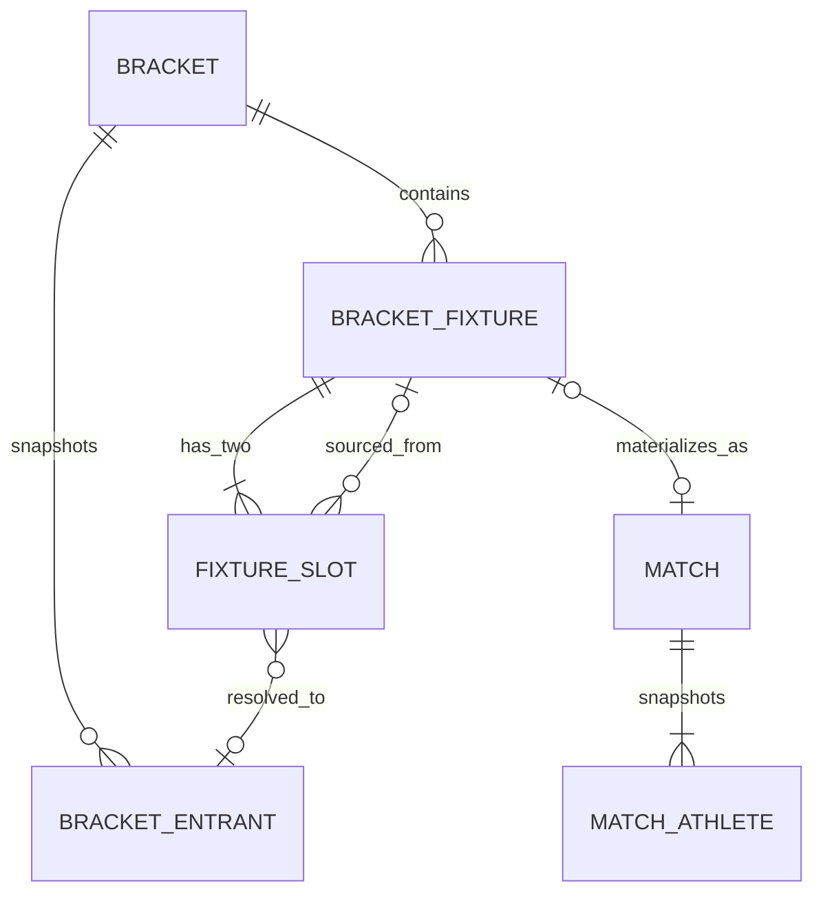

# ADR: Weight-class single-elimination brackets

## Status

Accepted for the Weight-Class Single-Elimination Bracket EPIC. This is an
architecture decision only; it intentionally adds no schema, API, or UI code.

## Context

The application has two deliberately different concepts today:

- `TournamentAthlete` is a mutable tournament registration.
- `Match` is a scoring-ready operational contest. It has exactly two
  `MatchAthlete` snapshots (red and blue), a public ID, four hashed access
  credentials, sessions, rounds, score events, penalties, reset/undo history,
  auditing, and realtime state.

Creating speculative `Match` rows for a future bracket round would violate
that contract. It would also expose credentials before a contest is ready and
make the existing lifecycle and scoring paths handle zero or one athlete.

## Decision

Introduce a bracket domain alongside, rather than inside, the operational
match domain. A bracket is single elimination and is scoped to one tournament
and one weight class. At most one active bracket exists for that pair.

`BracketFixture` is a logical contest in the bracket. Its slots can be
unresolved, resolved from an entrant, or resolved from an earlier fixture. A
fixture has at most one operational `Match`; an operational match belongs to
at most one fixture. A `Match` remains a fully resolved scoring contest and is
never used as a placeholder.

### Proposed persistent model

The migration adds `Bracket`, `BracketEntrant`, `BracketFixture`, and
`BracketFixtureSlot` (names may use the project’s plural-table mapping style),
plus the minimum outcome and idempotency fields described below.

`Bracket` has an ID, `tournamentId`, `weightClassId`, `status`
(`ACTIVE`, `CANCELLED`, `COMPLETED`), `bracketSize`, confirmation/cancellation
timestamps and actors, `previewTokenHash`, `rosterFingerprint`, timestamps,
and optional `championEntrantId`. A partial unique index on
`(tournament_id, weight_class_id) WHERE status = 'ACTIVE'` enforces one active
bracket. The composite tournament/weight-class FK follows the roster model’s
existing tournament-boundary pattern.

`BracketEntrant` is an immutable confirmation-time snapshot: `bracketId`, the
optional provenance `athleteId`, seed/draw position, athlete name, organization
name, weight-class name, and timestamps. It is unique on `(bracketId,
athleteId)` and `(bracketId, drawPosition)`. It must not be updated after
confirmation; entity renames consequently do not rewrite bracket or match
history.

`BracketFixture` has `bracketId`, `roundNumber` (one-based),
`position` (one-based within a round), `state` (`PENDING`, `READY`,
`PREPARED`, `IN_PROGRESS`, `COMPLETED`, `AWAITING_WINNER_DECISION`,
`CANCELLED`), nullable unique `matchId`, nullable `winnerEntrantId`, and
timestamps. `(bracketId, roundNumber, position)` is unique. There are exactly
two slot rows per fixture, enforced by application creation and a deferred
database constraint/trigger; slots are numbered `1` and `2` uniquely per
fixture.

`BracketFixtureSlot` has `fixtureId`, `slotNumber`, exactly one immutable
source (`entrantId` for an opening position or `sourceFixtureId` for a later
position), and nullable `resolvedEntrantId`. For an opening bye the source is
explicitly `NULL` and `isBye` is true; for all other slots `isBye` is false and
one source is required. A check constraint prevents both a source and a bye.
The fixture builder creates a complete power-of-two draw tree but omits any
`BYE vs BYE` node; it creates exactly `athleteCount - 1` fixtures when there
are two or more entrants. With one entrant it creates no fixture and sets that
entrant as champion; with zero entrants confirmation is rejected. A database
trigger (or equivalent deferred validation during the same transaction) rejects
two bye slots and validates that source fixtures belong to the same bracket.

The existing `Match` gains a nullable unique `bracketFixtureId` FK (the
fixture’s `matchId` is represented by this one FK, not both), which prevents a
match from feeding multiple fixtures. It also gains an authoritative outcome:
`winnerMatchAthleteId` and `winnerState` (`UNDECIDED`, `DECIDED`,
`AWAITING_ADMIN_DECISION`). The winner FK must refer to one of that match’s
two `MatchAthlete` rows; PostgreSQL cannot express that cross-row invariant
with a simple FK, so the write service validates it and a trigger is added in
the migration. A separate `MatchWinnerDecision` audit record stores source
(`RULES` or `ADMIN_TIEBREAK`), actor (nullable only for rules), effective-score
snapshot, reason, and timestamps. Existing standalone matches can have an
outcome but no fixture.

All new mutation endpoints accept an `Idempotency-Key`. An `IdempotencyRecord`
stores scope, key, request digest, completed response/status and expiry; the
unique `(scope, key)` returns the original result for an identical retry and
rejects key reuse with a different digest.

### Fixture and match lifecycle

```mermaid
stateDiagram-v2
  [*] --> PENDING_PARTICIPANTS
  PENDING_PARTICIPANTS --> READY: both slots resolved
  READY --> MATCH_PREPARED: admin prepares linked match and credentials
  MATCH_PREPARED --> COMPLETED: decisive effective score; propagate winner
  MATCH_PREPARED --> AWAITING_WINNER: tied effective score; store snapshot
  AWAITING_WINNER --> COMPLETED: audited manual tie decision; propagate winner
  COMPLETED --> MATCH_PREPARED: reset/cancel result; clear decision and propagation
  AWAITING_WINNER --> MATCH_PREPARED: reset/cancel result; clear tie snapshot
  MATCH_PREPARED --> COMPLETED: undo restores decisive score events
  MATCH_PREPARED --> AWAITING_WINNER: undo restores tied score events
  PENDING_PARTICIPANTS --> CANCELLED: bracket cancellation
  READY --> CANCELLED: bracket cancellation
```

At confirmation, the service creates the bracket, entrants, fixtures, and
slots only. It resolves byes immediately and propagates them transactionally.
No `Match`, `MatchAthlete`, access code, session, round, or realtime record is
created at this point. A fixture is `READY` only when both resolved slots are
non-bye entrants. “Prepare match” is an explicit admin action and only works
for a ready fixture without a match. It snapshots the two resolved entrants
into ordinary red/blue `MatchAthlete` rows and uses the established match
creation/credential service to create the public ID and all required access
roles. It records `PREPARED`; the existing match lifecycle then owns scoring.

On final match completion, the bracket outcome adapter asks the sport-group
rules registry to determine the winner from the effective score. For
`ONE_ON_ONE_COMBAT`, the higher effective score wins. A tie produces
`AWAITING_WINNER_DECISION`; it never selects randomly. An ADMIN or
SUPER_ADMIN resolves that state through a confirmed endpoint, supplying the
selected existing match athlete and a required reason. The operation creates an
audit event and winner-decision record. Winner propagation locks the fixture
and all reachable downstream fixtures in round/position order, writes only a
previously-null identical resolved slot, and is idempotent. A child becomes
ready only after both slots resolve; it is never automatically prepared.

Result cancellation/reset/undo retains the standalone behavior: standalone
matches have no bracket propagation to retract or restore. For a bracket-linked
match, reset/cancellation retracts either a completed winner or an awaiting
tie decision. It clears `winnerEntrantId` and `winnerDecision` (including the
tied-score snapshot), returns the fixture to `MATCH_PREPARED`, and keeps the
same linked `Match` and access credentials. A completed winner also clears its
unprepared downstream slot(s), returning affected downstream fixtures to
`PENDING_PARTICIPANTS` where a participant is again unresolved.

Retraction is permitted only while its downstream fixture has no materialized
`Match`. If any affected downstream fixture has a prepared match, reject with
`BRACKET_DOWNSTREAM_MATCH_PREPARED` before changing result data; the existing
downstream match, credentials, slots, and audit history are never altered.
Undo restores score events before restoring the finished match state and then
runs the same idempotent outcome calculation as normal completion. It therefore
recreates exactly one decisive propagation or one fresh `AWAITING_WINNER`
snapshot. Fixture rows are locked in lexical UUID order on all outcome paths;
the operational match row is locked by the lifecycle transaction first.

### Preview and confirmation

`POST /admin/tournaments/:tournamentId/weight-classes/:weightClassId/brackets/preview`
validates tournament access, active tournament/weight class, and the active
eligible roster, randomly draws each eligible athlete once, and returns the
renderable proposed tree plus a short-lived opaque token. It persists nothing.
The web component keeps this token only in React component memory: it is not
placed in a URL, query cache, local/session storage, telemetry, or logs.
Redraw requests a new preview; Cancel simply discards it.

The token is authenticated encryption (for example a versioned AEAD envelope
with key ID and rotation support), not a client-readable signed JSON blob. Its
protected claims are token ID, tournament ID, weight-class ID, exact randomized
arrangement, canonical roster fingerprint, issued-at, expiry, and issuer/audience.
It has a five-minute maximum lifetime, is verified with server time and
constant-time authentication, and is never logged. Confirmation accepts the
token only in the body over authenticated HTTPS, recomputes the canonical
eligible roster fingerprint under lock, and rejects changes or expiry. In the
same transaction it creates the bracket and records the SHA-256 token hash on
the bracket; retries with the same idempotency key replay, while replay under a
new key conflicts because the active-bracket index and stored token hash make
the preview consumed.

### API surface and UI scope

The admin API is scoped under the tournament and weight class:

- preview, confirm, list/get active bracket, and cancel/reset bracket;
- `POST .../fixtures/:fixtureId/prepare-match` (response is the normal match
  plus raw credentials once);
- `POST .../fixtures/:fixtureId/winner-decision` for an awaiting tie;
- existing match finish/reset/undo responses gain outcome/fixture progression
  fields where applicable.

All operations use the existing admin authorization and tournament ownership
checks. The tournament administration screen gains bracket management and a
preview dialog. Match administration displays bracket fixtures separately from
the existing standalone-match list; standalone created matches retain their
current create/edit flows. Public bracket presentation is explicitly out of
scope. Existing public views and scoreboards continue to expose operational
matches only.

Raw credentials retain the present one-time-display policy: only creation or
regeneration returns raw codes, responses are `Cache-Control: no-store`, and
only bcrypt hashes are persisted. Preparing a fixture invokes that same path;
listing a fixture or fetching a match never returns codes. A bracket-linked
match rejects athlete replacement with `BRACKET_MATCH_ATHLETES_IMMUTABLE`.

### Concurrency, errors, and audit

Every bracket mutation uses a Prisma transaction and locks the tournament row
first, then the weight-class row, bracket row, fixtures in ascending
`roundNumber, position`, and matches by UUID. Roster athlete/weight-class
mutations take the same tournament/weight-class lock before checking bracket
references. This prevents confirmation racing an athlete move/deactivation,
and prevents completion, prepare, reset, and winner decision from producing
two downstream values. Unique constraints remain the final arbiter and are
translated to stable conflicts.

All new domain failures are structured `{ code, message, details? }`, follow
the existing uppercase error-code convention, and use 400 for malformed input,
403 for authorization, 404 for inaccessible resources, 409 for lifecycle,
staleness, and locking conflicts. Initial codes include
`BRACKET_ALREADY_ACTIVE`, `BRACKET_PREVIEW_EXPIRED`,
`BRACKET_PREVIEW_STALE`, `BRACKET_PREVIEW_INVALID`,
`BRACKET_FIXTURE_NOT_READY`, `BRACKET_FIXTURE_ALREADY_PREPARED`,
`BRACKET_TIE_DECISION_REQUIRED`, `BRACKET_WINNER_DECISION_INVALID`,
`BRACKET_DOWNSTREAM_MATCH_PREPARED`, `BRACKET_MATCH_ATHLETES_IMMUTABLE`,
`BRACKET_ATHLETE_LOCKED`, and `BRACKET_WEIGHT_CLASS_LOCKED`.

New `AuditEventType` values describe preview confirmation, cancellation,
fixture preparation, automatic/rules winner, tie decision, propagation,
retraction, and blocked mutation. Audit metadata includes bracket/fixture IDs,
before/after slot resolution, match ID, score snapshot, actor, and idempotency
key hash—not raw preview tokens or access codes.

### Roster and compatibility rules

Active entrants are exactly active `TournamentAthlete` rows in the selected
active weight class at confirmation. They must be scoped to the tournament.
After confirmation, any entrant in an active bracket cannot be deactivated or
moved to another weight class; an active referenced weight class cannot be
deactivated. The roster services must enforce this under the shared locks.
Allowed name/organization/weight-class renames do not change snapshots.

Legacy and manually created matches remain standalone (`bracketFixtureId IS
NULL`) and retain their current creation, athlete replacement, lifecycle,
credentials, realtime, reset, undo, public view, and audit behavior. No legacy
backfill is inferred. Existing matches may receive an outcome lazily when they
finish after rollout; historical finished matches remain `UNDECIDED` unless a
separate audited remediation is approved.

## Testing and rollout

### Phase 3 persistence implementation

Confirmed brackets are stored in `tournament_brackets`, `bracket_entrants`,
`bracket_fixtures`, and `bracket_slots`. The authoritative operational link is
the nullable, unique `matches.bracket_fixture_id`; existing and manually
created matches leave it null. `tournament_brackets_one_current_per_weight_class_key`
is a PostgreSQL partial unique index over `ACTIVE` and `COMPLETED` brackets
because Prisma cannot model it. Migration `20260913160000_bracket_query_index_cleanup`
removes only indexes duplicated exactly by those unique constraints; it does not
change the current-bracket, fixture-order, linked-match, roster-eligibility, or
filtered-match query access paths.

The migration uses a check constraint for exactly one slot source and direct
slot resolution, plus a trigger to ensure slot sources, resolutions, and
fixture winners belong to the same bracket. It intentionally cannot guarantee
that a fixture has exactly two slots, that a winner-source slot stays
unresolved until its source is complete, or that a winner is a participant:
the future bracket service creates the complete tree and enforces those
lifecycle invariants transactionally.

Unit-test draw construction for 1, 2, non-power-of-two, and power-of-two
entrant counts; each entrant exactly once; no double bye; and `n - 1`
fixtures. Test token tampering, expiry, replay, redraw/cancel non-persistence,
and roster-fingerprint conflicts. Add transaction/concurrency integration tests
for simultaneous confirmation, prepare, completion, reset, roster mutation,
and idempotency retries. Test score winner calculation, tie decision authority
and audit, idempotent propagation, bye propagation, and blocked upstream
changes after downstream preparation. Regression-test every existing standalone
match/access-code/reset/undo/realtime contract. Add API/controller authorization
tests and web tests that prove preview-only state is memory-only and bracket and
standalone listings are separate.

Roll out as an additive, backwards-compatible migration: enums/tables/FKs and
indexes first, then the bracket service and rules outcome adapter, then API and
admin UI behind a server feature flag. Enable for `ONE_ON_ONE_COMBAT` only after
integration and migration verification. Do not create matches or credentials
in data migration. Rollback disables the flag; it does not delete confirmed
brackets or operational match history.

## Non-goals

Double elimination, round robin, seeding policy beyond cryptographically secure
random draw, public bracket display, automatic next-match preparation,
automated tie breaking, changing scoring rules, and altering legacy standalone
match semantics are not part of this EPIC.
